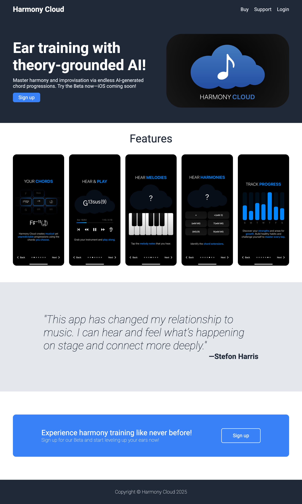

# Harmony Cloud – Landing Page (Unofficial)

This is a **practice landing page** project inspired by Harmony Cloud™, an ear training app lead by world-renowned jazz musician and educator Stefon Harris.

## Background

I’ve had the opportunity to speak directly with Stefon Harris and have been invited to contribute to his app. This project serves as both a tribute to that vision and a way to sharpen my frontend development skills.

## Why This Project
As part of my web development journey through The Odin Project, I chose to model this landing page after Harmony Cloud™.

## Live Demo

[View the live site](https://ivanrsalcedo.github.io/harmony-cloud-landing-page/)

